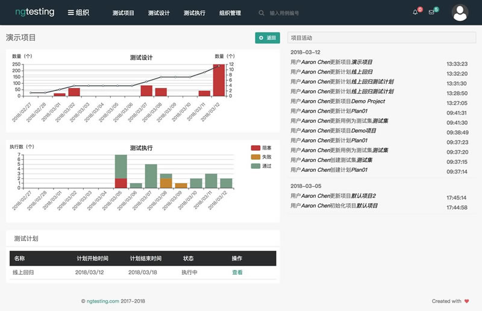
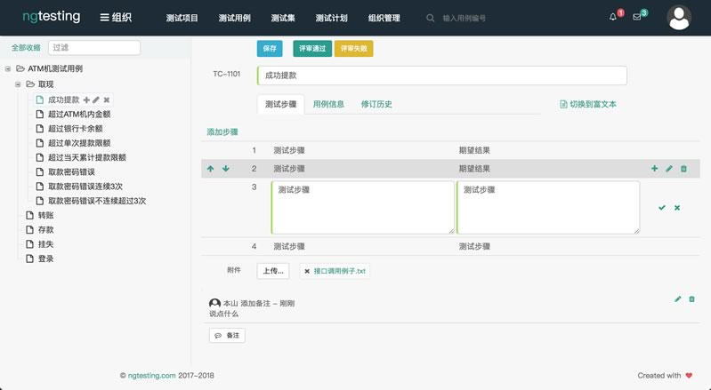
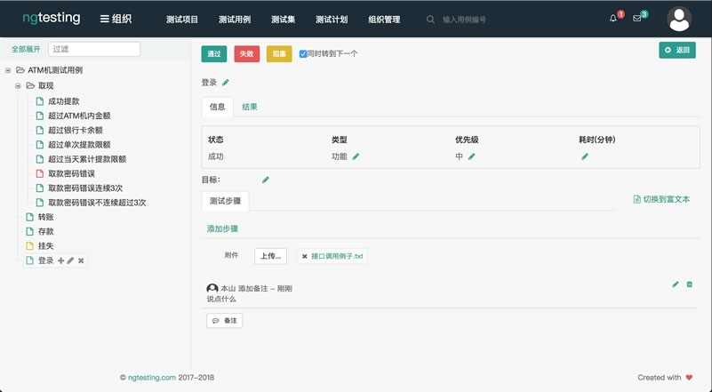
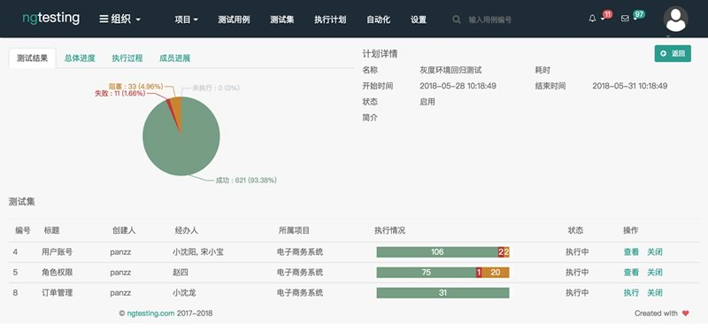
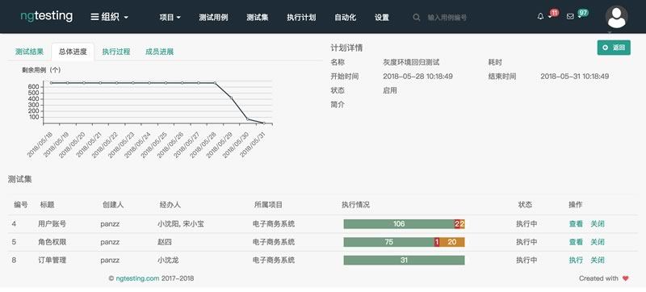
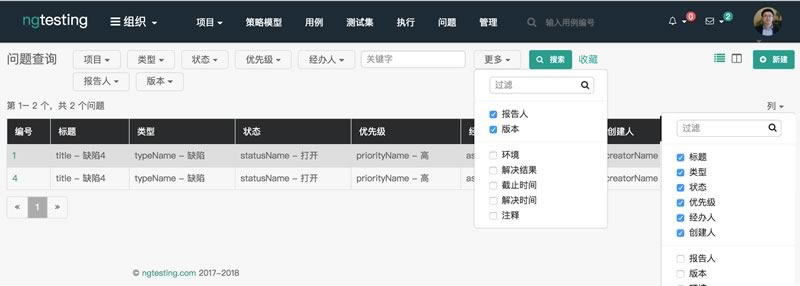
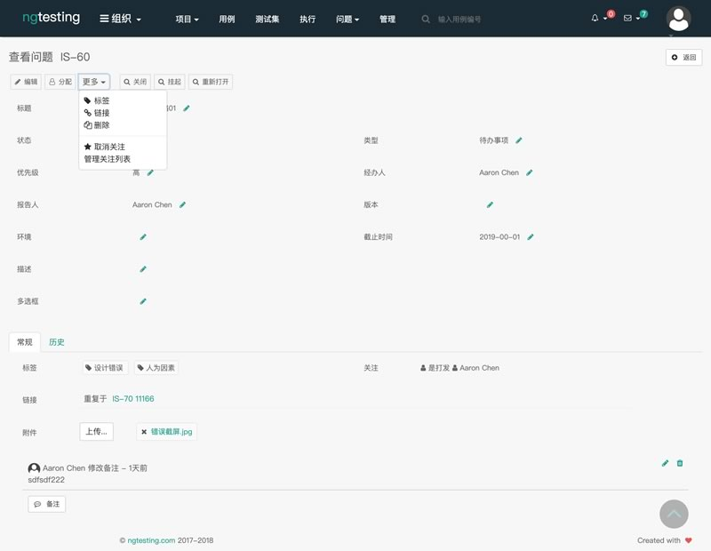
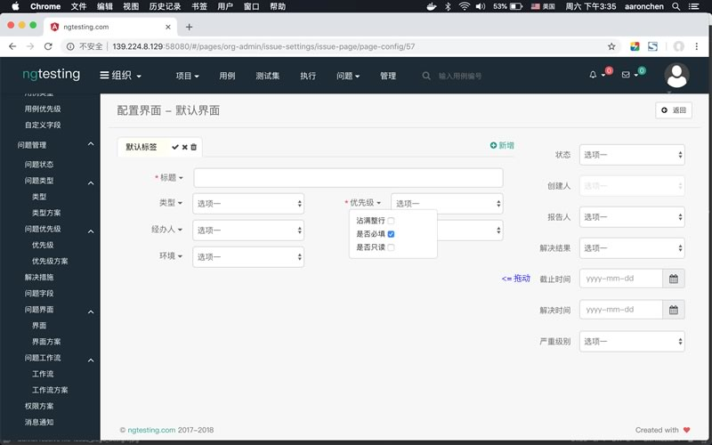
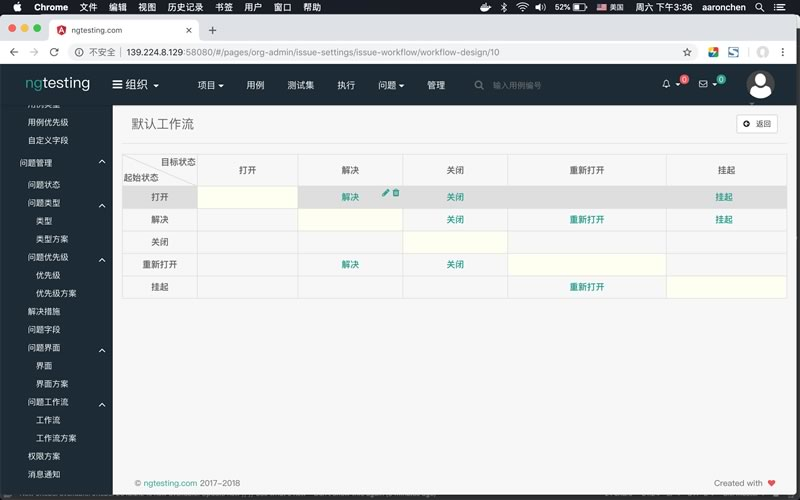

# Next Generation Testing Tools
交流合作请加微信, Wechat: 462826

DEMO: http://139.224.8.129:58080

AngularJS, SockJS, SpringBoot, MyBatis, PostgreSQL  

## Quick start
### Use Docker

1. Install docker and docker-compose;
2. Download file from https://raw.githubusercontent.com/aaronchen2k/ngtesting-platform/master/docker-compose.yml ;
3. In same dir, enter "docker-compose up;docker-compose logs -f;" to launch.
4. Open http://localhost:58080/test.html using Chrome.

## Test Project

## Test Case

## Test Execution

## Test Plan

## Issue Query

## Issue View

## Issue Page Design

## Issue Workflow Design

## Licenses

All SERVER SIDE source code is licensed under the [GPLv3 License](LICENSE.md).
